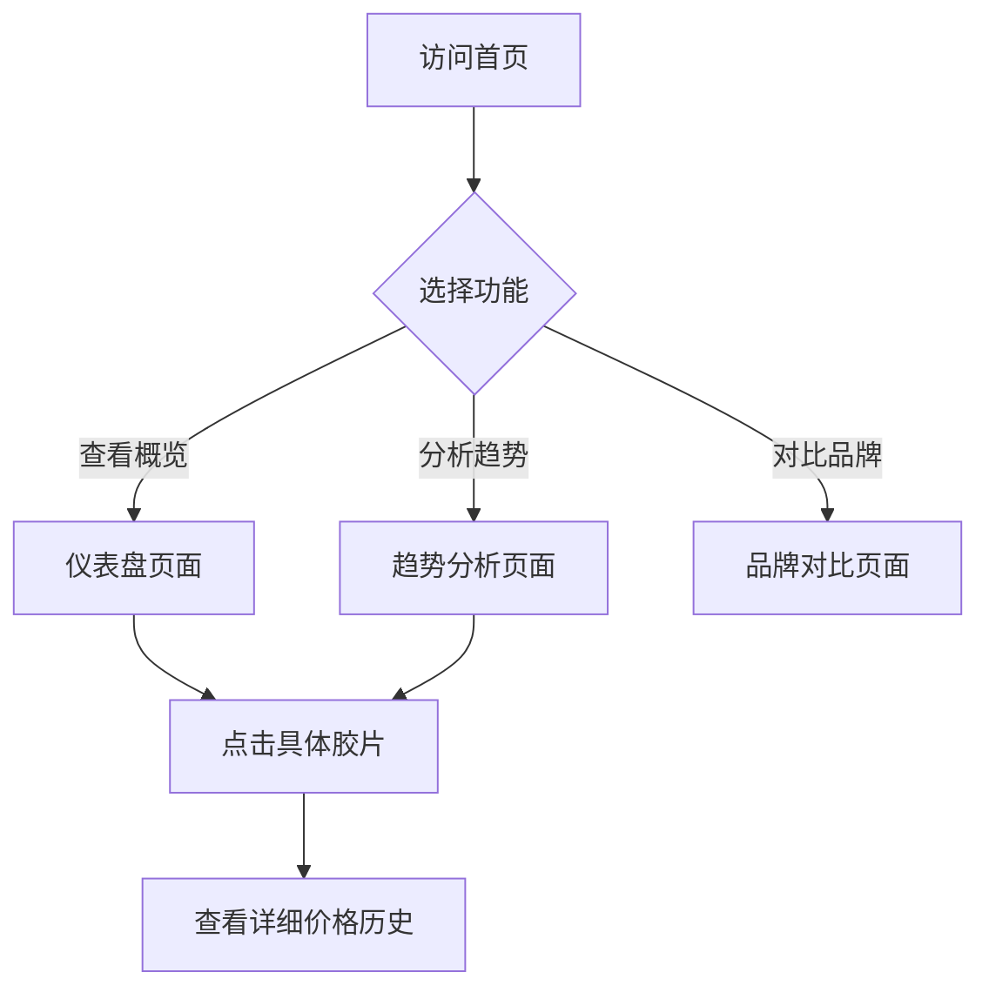
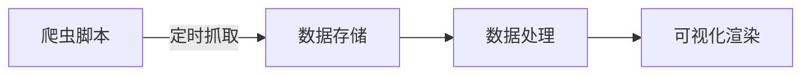

# 胶片价格爬虫可视化网站 - 产品需求文档

## 1. 产品概述

一个展示各类胶片产品实时价格的爬虫可视化平台，帮助摄影爱好者追踪胶片市场价格趋势、对比不同品牌和型号的性价比。

- 聚合主流电商平台的胶片价格数据（京东、天猫、拼多多等）
- 通过直观的图表展示价格走势和品牌对比
- 为用户提供最佳购买时机的参考建议

## 2. 核心功能

### 2.1 功能模块

1. **价格概览仪表盘**：展示热门胶片品牌的均价区间、近期涨价幅度、本周热门
2. **价格趋势图表**：支持按品牌、按胶片类型（彩色负片、黑白反转片等）查看历史价格走势
3. **品牌对比工具**：多品牌同类型胶片横向价格对比
4. **价格提醒**：设置价格阈值，低于心理价位时提醒用户

### 2.2 页面详情

| 页面名称 | 模块名称 | 功能描述 |
|---------|---------|---------|
| 首页仪表盘 | 价格概览卡片 | 展示总数据量、涉及品牌数、平均价格 |
| 首页仪表盘 | 热门胶片TOP10 | 列表展示近期搜索/查看最多的胶片 |
| 首页仪表盘 | 价格走势图 | 本周热门胶片的7日价格趋势折线图 |
| 趋势分析页 | 品牌筛选器 | 按品牌（ Kodak/Fujifilm/Ilford等）筛选 |
| 趋势分析页 | 类型筛选器 | 按胶片类型（135/120/4x5）筛选 |
| 趋势分析页 | 价格趋势图 | 选中胶片的30日价格走势（ECharts折线图） |
| 品牌对比页 | 对比选择器 | 最多选择4款胶片进行横向对比 |
| 品牌对比页 | 对比图表 | 柱状图展示价格、雷达图展示性价比 |

## 3. 核心流程

### 3.1 用户浏览流程

### 3.2 数据更新流程

## 4. 用户界面设计

### 4.1 设计风格

**复古胶片馆风格** - 融合胶片摄影的温暖质感与现代数据可视化的精确感

- **主色调**：深棕炭黑 `#1a1a1a` + 胶片黄 `#f5c542`
- **辅助色**：暖白 `#faf8f5`、复古红 `#c44536`、胶片绿 `#4a5d23`
- **按钮风格**：圆角矩形，带微妙阴影，hover时有光泽过渡效果
- **字体选择**：
  - 标题：`Playfair Display`（衬线体，优雅复古）
  - 正文：`Source Sans Pro`（清晰易读）
- **布局风格**：卡片式布局，左侧导航，顶部筛选器
- **图标风格**：线性图标，带有手绘质感

### 4.2 页面设计概述

| 页面名称 | 模块名称 | UI元素描述 |
|---------|---------|-----------|
| 首页仪表盘 | 价格概览卡片 | 深色背景卡片，金色边框点缀，数字使用大号衬线字体 |
| 首页仪表盘 | 热门胶片列表 | 横向滚动卡片，每张卡片包含品牌logo、名称、最新价格 |
| 首页仪表盘 | 趋势迷你图 | 卡片右下角嵌入微型折线图 |
| 趋势分析页 | 筛选器区域 | 胶囊按钮组，选中状态有金色下划线 |
| 趋势分析页 | 主图表区域 | 全宽ECharts图表，深色主题，网格线使用半透明金色 |
| 品牌对比页 | 对比选择器 | 搜索下拉框 + 已选标签（可删除） |
| 品牌对比页 | 柱状对比图 | 横向柱状图，按价格排序，颜色按品牌区分 |

### 4.3 响应式设计

- **桌面端**（>1200px）：三栏布局，导航侧边栏展开
- **平板端**（768px-1200px）：两栏布局，导航折叠为汉堡菜单
- **移动端**（<768px）：单栏布局，图表横向滚动，筛选器改为抽屉式

## 5. 技术约束

- 前端：React 18 + Vite + TailwindCSS
- 图表库：ECharts（支持丰富的可视化类型）
- 爬虫：Node.js + Cheerio（服务端定时爬取）
- 数据存储：JSON文件存储（轻量级，无需数据库）
- 模拟数据：提供Mock数据用于演示，避免依赖外部电商API
