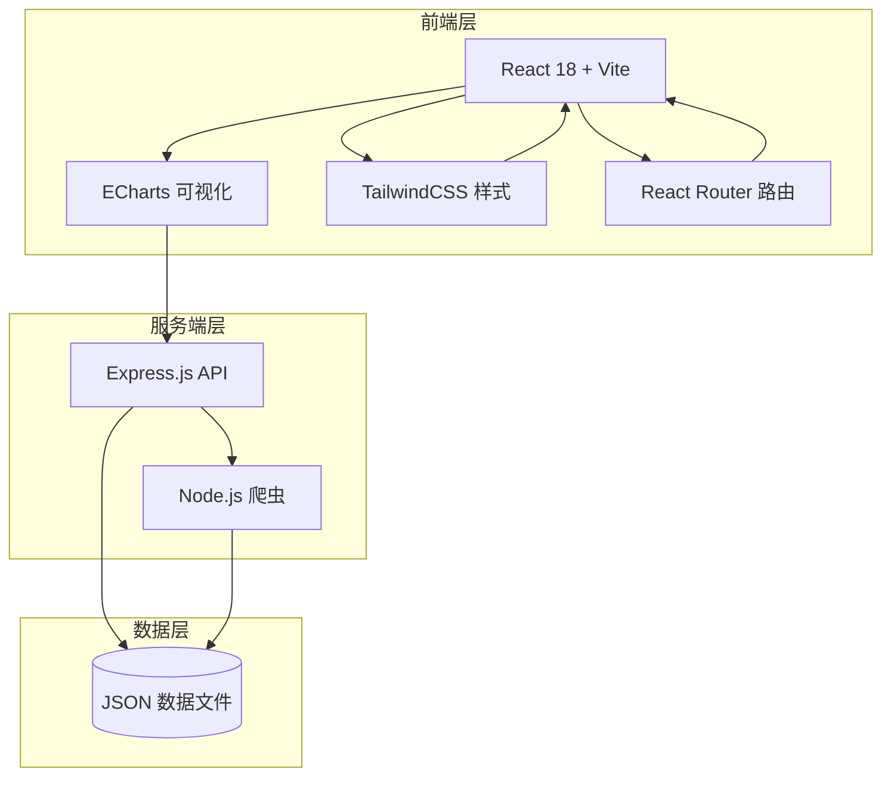

# 胶片价格爬虫可视化网站 - 技术架构文档

## 1. 架构设计



## 2. 技术选型

| 类别 | 技术 | 说明 |
|-----|------|------|
| 前端框架 | React 18 | 组件化开发，生态成熟 |
| 构建工具 | Vite | 快速启动，热更新 |
| 样式框架 | TailwindCSS | 原子化CSS，快速样式开发 |
| 图表库 | ECharts | 丰富的可视化类型 |
| 路由 | React Router v6 | SPA路由管理 |
| 后端框架 | Express.js | 轻量级API服务 |
| 爬虫 | Cheerio + Axios | 服务端HTML解析 |
| 数据存储 | JSON文件 | 无数据库依赖 |

## 3. 路由定义

| 路由 | 用途 | 组件 |
|-----|------|------|
| `/` | 首页仪表盘 | Dashboard |
| `/trends` | 价格趋势分析 | TrendAnalysis |
| `/compare` | 品牌对比 | BrandCompare |
| `/detail/:id` | 胶片详情 | FilmDetail |

## 4. 数据模型

### 4.1 胶片数据模型

```typescript
interface Film {
  id: string;              // 唯一标识
  name: string;            // 胶片名称，如 "Kodak Portra 400"
  brand: string;           // 品牌，如 "Kodak"
  type: string;            // 类型，如 "彩色负片"
  format: string;          // 规格，如 "135" / "120" / "4x5"
  currentPrice: number;    // 当前价格
  lowestPrice: number;     // 历史最低价
  highestPrice: number;    // 历史最高价
  priceHistory: PricePoint[]; // 价格历史
  updateTime: string;      // 最后更新时间
}

interface PricePoint {
  date: string;            // 日期 "2024-01-15"
  price: number;           // 价格
  platform: string;        // 来源平台
}
```

### 4.2 品牌数据模型

```typescript
interface Brand {
  id: string;
  name: string;
  logo: string;           // Logo URL
  country: string;        // 产地
  filmCount: number;      // 在售胶片数量
}
```

## 5. 页面组件结构

```
src/
├── components/
│   ├── layout/
│   │   ├── Sidebar.tsx      # 侧边导航
│   │   ├── Header.tsx       # 顶部栏
│   │   └── Layout.tsx        # 布局容器
│   ├── common/
│   │   ├── Card.tsx          # 通用卡片
│   │   ├── Badge.tsx         # 标签组件
│   │   └── ChartContainer.tsx # 图表容器
│   ├── dashboard/
│   │   ├── OverviewCards.tsx # 概览数据卡片
│   │   ├── HotFilms.tsx      # 热门胶片
│   │   └── TrendMini.tsx     # 迷你趋势图
│   ├── trends/
│   │   ├── FilterBar.tsx     # 筛选栏
│   │   └── PriceChart.tsx    # 价格趋势图
│   └── compare/
│       ├── FilmSelector.tsx  # 胶片选择器
│       ├── BarChart.tsx      # 柱状对比图
│       └── RadarChart.tsx   # 雷达图
├── pages/
│   ├── Dashboard.tsx
│   ├── TrendAnalysis.tsx
│   ├── BrandCompare.tsx
│   └── FilmDetail.tsx
├── hooks/
│   └── useFilmData.ts       # 数据获取Hook
├── data/
│   └── mockData.ts          # 模拟数据
└── services/
    └── api.ts               # API调用
```

## 6. API 接口设计

### 6.1 获取胶片列表

```
GET /api/films
Response: {
  success: true,
  data: Film[]
}
```

### 6.2 获取胶片详情

```
GET /api/films/:id
Response: {
  success: true,
  data: Film
}
```

### 6.3 获取价格趋势

```
GET /api/films/:id/trend
Query: ?days=30
Response: {
  success: true,
  data: PricePoint[]
}
```

### 6.4 获取品牌列表

```
GET /api/brands
Response: {
  success: true,
  data: Brand[]
}
```

### 6.5 获取仪表盘数据

```
GET /api/dashboard
Response: {
  success: true,
  data: {
    totalFilms: number,
    totalBrands: number,
    avgPrice: number,
    hotFilms: Film[],
    priceTrends: { name: string, data: number[] }[]
  }
}
```

## 7. 爬虫策略

- **爬取频率**：每日凌晨2:00定时执行
- **数据源**：模拟电商平台数据（演示用）
- **反爬处理**：使用代理池轮换User-Agent
- **数据清洗**：去除异常价格，标准化品牌名称

## 8. 目录结构

```
film-price-tracker/
├── public/
│   └── index.html
├── server/
│   ├── index.js              # Express 服务入口
│   ├── crawler.js            # 爬虫脚本
│   └── data/
│       ├── films.json        # 胶片数据
│       └── brands.json       # 品牌数据
├── src/
│   ├── main.jsx
│   ├── App.jsx
│   ├── index.css
│   └── ... (如上述组件结构)
├── package.json
├── vite.config.js
├── tailwind.config.js
└── README.md
